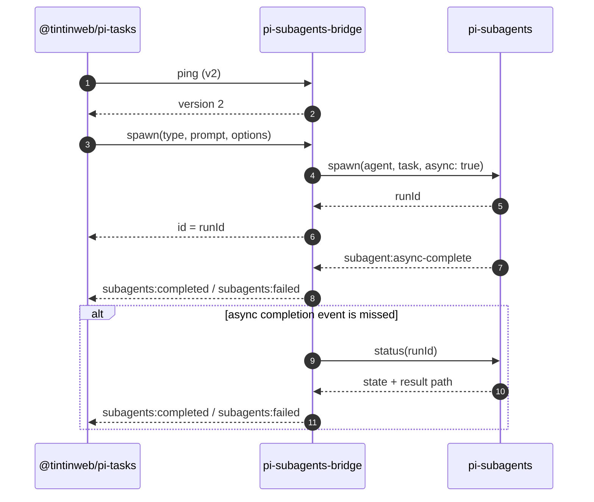

# pi-subagents-bridge

[](https://www.npmjs.com/package/@alexeiled/pi-subagents-bridge)
[](https://github.com/alexei-led/pi-subagents-bridge/actions/workflows/ci.yml?query=branch%3Amain)
[](https://nodejs.org/)
[](./LICENSE)

`pi-subagents-bridge` is a protocol adapter between two Pi extensions:

- [`@tintinweb/pi-tasks`](https://www.npmjs.com/package/@tintinweb/pi-tasks)
- [`pi-subagents`](https://www.npmjs.com/package/pi-subagents)

It makes `TaskExecute` work with `pi-subagents` by translating the `pi-tasks` subagent RPC into the RPC and completion events that `pi-subagents` exposes. It also exposes a separate, generic plan-exec RPC for direct execution clients.

## What it does

`@tintinweb/pi-tasks` expects a v2 subagent protocol.
`pi-subagents` exposes a v1 RPC plus async completion events.
This bridge sits between them and handles the mismatch.

Specifically, it:

- answers the `pi-tasks` v2 ping handshake
- forwards `spawn` and `stop` requests to `pi-subagents`
- translates `pi-subagents` completion events back into `pi-tasks` task updates
- falls back to polling `pi-subagents` run `status` if an async completion event is missed
- keeps the generic plan-exec RPC separate from all `pi-tasks` channels

### Request and completion flow



## Install

Install the two extensions being bridged, then install the bridge:

```bash
pi install npm:@tintinweb/pi-tasks
pi install npm:pi-subagents
pi install npm:@alexeiled/pi-subagents-bridge
```

Requirements:

- Node `>= 22.19.0`
- Pi with extension loading enabled

## Usage

Create tasks with `TaskCreate`, then execute them with `TaskExecute`.

```text
TaskCreate(subject="Write a short plan", agentType="general-purpose", ...)
TaskExecute(task_ids=["1"])
```

### Agent type mapping

The bridge preserves task agent names except for the compatibility aliases that `pi-tasks` examples commonly use.

| `TaskCreate(..., agentType=...)` | `pi-subagents` agent     |
| -------------------------------- | ------------------------ |
| `general-purpose`                | `delegate`               |
| `Explore`                        | `scout`                  |
| `explore`                        | `scout`                  |
| anything else                    | passed through unchanged |

Use an execution-capable agent for tasks that need shell commands, builds, or tests.
A read-only agent can still be useful for read-only tasks such as review or metadata inspection.

## Bridge behavior

### Request flow

| `pi-tasks` input      | Bridge behavior                                   |
| --------------------- | ------------------------------------------------- |
| `subagents:rpc:ping`  | replies locally with protocol version `2`         |
| `subagents:rpc:spawn` | sends a `pi-subagents` v1 `spawn` request         |
| `subagents:rpc:stop`  | sends a best-effort `pi-subagents` `stop` request |

Spawned runs are always forwarded as:

- `async: true`
- `clarify: false`
- `context: "fresh"`

The bridge returns the spawned run ID back to `pi-tasks` and tracks that run as bridge-owned state. It runs at most **two** bridge-owned tasks at once. A task without an explicit `maxTurns` receives a **12-turn** budget.

### Completion flow

For runs the bridge spawned itself, it converts `pi-subagents` outcomes into `pi-tasks` events:

- success → `subagents:completed`
- failure → `subagents:failed`
- stopped or paused run → `subagents:failed` with `status: "stopped"`

If `subagent:async-complete` does not arrive, the bridge polls `pi-subagents` `status`, reads the result file path from that status output, and emits the same completion event that `pi-tasks` expects. If a terminal status arrives before its result file is readable, the bridge retries for up to five seconds instead of silently dropping the result.

## Generic plan-exec RPC

This protocol is independent of `pi-tasks`. Send `{ version: 1, requestId, method, ... }` on `plan-exec:bridge:v1:request`; replies use `plan-exec:bridge:v1:reply:<requestId>`.

Supported methods are `ping`, `spawn`, `operation`, `status`, `result`, `stop`, and `adopt`.

- `spawn` requires a durable top-level `operationId`, top-level `cwd` when needed, and `params.agent` plus `params.task`. It forwards supported execution fields (`async`, `clarify`, `context`, `model`, `turnBudget`, `control`, `acceptance`, and `timeout`) to `pi-subagents`. It accepts `timeout` or `timeoutMs` and rejects mismatched values; either maps to pi-subagents `timeoutMs`. It returns `{ runId, asyncDir? }`. A repeated operation ID reuses the original reply for this Pi process lifetime.
- `operation` requires `operationId` and never starts a child. It returns `{ state: "absent" }`, `{ state: "pending" }`, `{ state: "found", runId, asyncDir? }`, or `{ state: "unknown", error }`. Its lookup map survives bridge re-registration in one Pi process but is not durable across a full Pi restart. It retains at most 127 completed outcomes and never evicts active operations. Clients must use it after an unknown spawn outcome and must not blindly launch a second child.
- `status` and `result` return normalized observations from the `pi-subagents` status RPC. `result` uses status because `pi-subagents` has no separate result RPC.
- `stop` delegates to the `pi-subagents` stop RPC.
- `adopt` validates and observes a run but does not transfer ownership or promise cross-session stop support.

Failures use `{ success: false, error: { code, message } }`. `operation_capacity`
means the bridge has 128 unresolved active operation IDs and will not evict any
to accept another spawn.

## TaskExecute-specific safeguards

`TaskExecute` is queue-style orchestration, not direct subagent supervision.
Because of that, the bridge also applies two execution defaults to bridge-spawned runs:

- disables `pi-subagents` acceptance gating
- disables `pi-subagents` live control nudges

This avoids false pauses on missing acceptance reports and avoids misleading background `needs attention` notices for normal task runs. Repeated copies of the same spawn request are coalesced, so retries cannot launch duplicate bridge-owned agents.

## Scope and limits

This package is intentionally narrow.

It does:

- bridge `TaskExecute` task launches to `pi-subagents`
- track only runs spawned through this bridge
- ignore unrelated `pi-subagents` runs

It does not:

- replace `pi-tasks` task orchestration
- act as a generic adapter for `pi-subagents` methods beyond the documented plan-exec protocol
- support loading `@tintinweb/pi-subagents` alongside this bridge

Do not load `@tintinweb/pi-subagents` at the same time as this package.

## More detail

- [`docs/design.md`](./docs/design.md) — bridge behavior and maintenance rules
- [`docs/protocol-research.md`](./docs/protocol-research.md) — upstream protocol notes
- [`DEVELOPMENT.md`](./DEVELOPMENT.md) — local validation and release workflow
- [`CHANGELOG.md`](./CHANGELOG.md) — release history and RPC compatibility changes
