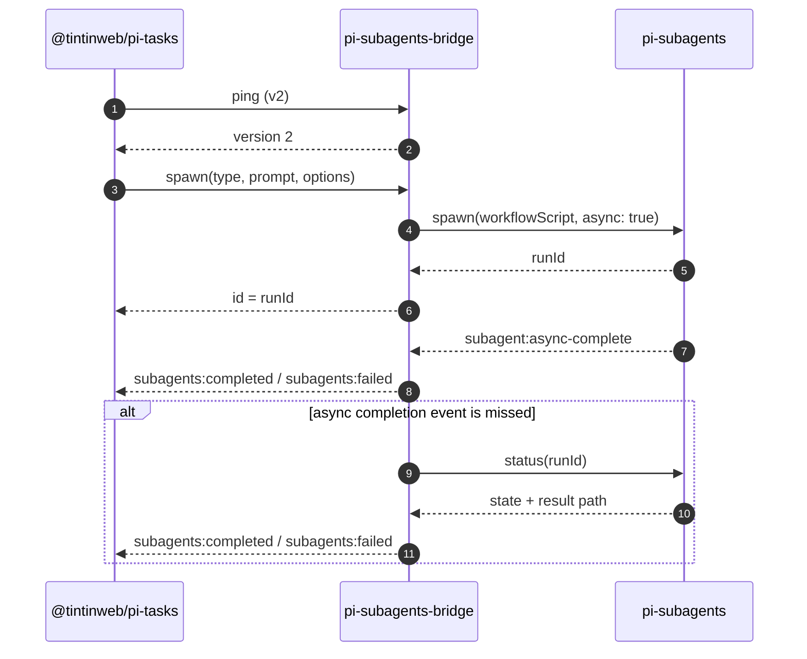

# pi-subagents-bridge

[](https://www.npmjs.com/package/@alexeiled/pi-subagents-bridge)
[](https://github.com/alexei-led/pi-subagents-bridge/actions/workflows/ci.yml?query=branch%3Amain)
[](https://nodejs.org/)
[](./LICENSE)

`pi-subagents-bridge` is a protocol adapter between two Pi extensions:

- [`@tintinweb/pi-tasks`](https://www.npmjs.com/package/@tintinweb/pi-tasks)
- [`pi-subagents`](https://www.npmjs.com/package/pi-subagents)

It makes `TaskExecute` work with `pi-subagents` by translating the `pi-tasks` subagent RPC into the RPC and completion events that `pi-subagents` exposes. It also exposes a separate, generic plan-exec RPC for direct execution clients.

## What it does

`@tintinweb/pi-tasks` expects a v2 subagent protocol.
`pi-subagents` exposes a v1 RPC plus async completion events.
This bridge sits between them and handles the mismatch.

Specifically, it:

- answers the `pi-tasks` v2 ping handshake
- forwards `spawn` and `stop` requests to `pi-subagents`
- translates `pi-subagents` completion events back into `pi-tasks` task updates
- falls back to polling `pi-subagents` run `status` if an async completion event is missed
- keeps the generic plan-exec RPC separate from all `pi-tasks` channels

### Request and completion flow


```mermaid
sequenceDiagram
  autonumber
  participant Tasks as @tintinweb/pi-tasks
  participant Bridge as pi-subagents-bridge
  participant Subs as pi-subagents

  Tasks->>Bridge: ping (v2)
  Bridge-->>Tasks: version 2

  Tasks->>Bridge: spawn(type, prompt, options)
  Bridge->>Subs: spawn(workflowScript, async: true)
  Subs-->>Bridge: runId
  Bridge-->>Tasks: id = runId

  Subs-->>Bridge: subagent:async-complete
  Bridge-->>Tasks: subagents:completed / subagents:failed

  alt async completion event is missed
    Bridge->>Subs: status(runId)
    Subs-->>Bridge: state + result path
    Bridge-->>Tasks: subagents:completed / subagents:failed
  end
```

## Install

Install the two extensions being bridged, then install the bridge:

```bash
pi install npm:@tintinweb/pi-tasks
pi install npm:pi-subagents
pi install npm:@alexeiled/pi-subagents-bridge
```

Requirements:

- Node `>= 22.19.0`
- Pi `>= 0.84.4` with extension loading enabled; tested with Pi `0.87.0`

The bridge uses Pi's public extension event API. Future Pi releases still need
validation if that API or the upstream subagent protocol changes.

The operation journal supports schema versions 1–5. Versions 4 and 5 retain their
version and extra fields when opened by this bridge. Unknown versions are rejected
before database changes; update the bridge instead of deleting or resetting the journal.

## Usage

Create tasks with `TaskCreate`, then execute them with `TaskExecute`.

```text
TaskCreate(subject="Write a short plan", agentType="general-purpose", ...)
TaskExecute(task_ids=["1"])
```

### Agent type mapping

The bridge preserves task agent names except for the compatibility aliases that `pi-tasks` examples commonly use.

| `TaskCreate(..., agentType=...)` | `pi-subagents` agent     |
| -------------------------------- | ------------------------ |
| `general-purpose`                | `delegate`               |
| `Explore`                        | `scout`                  |
| `explore`                        | `scout`                  |
| anything else                    | passed through unchanged |

Use an execution-capable agent for tasks that need shell commands, builds, or tests.
A read-only agent can still be useful for read-only tasks such as review or metadata inspection.

## Bridge behavior

### Request flow

| `pi-tasks` input      | Bridge behavior                                   |
| --------------------- | ------------------------------------------------- |
| `subagents:rpc:ping`  | replies locally with protocol version `2`         |
| `subagents:rpc:spawn` | sends a `pi-subagents` v1 `spawn` request         |
| `subagents:rpc:stop`  | sends a best-effort `pi-subagents` `stop` request |

Spawned runs are always forwarded as:

- one-child `workflowScript` execution
- `async: true`
- `context: "fresh"`
- `control: { enabled: false }` on the outer workflow and its child

The bridge does not send the removed public `clarify` field.

The bridge returns the spawned run ID back to `pi-tasks` and tracks that run as bridge-owned state. It runs at most **two** bridge-owned tasks at once. A task without an explicit `maxTurns` receives a **12-turn** budget.

### Completion flow

For runs the bridge spawned itself, it converts `pi-subagents` outcomes into `pi-tasks` events:

- success → `subagents:completed`
- failure → `subagents:failed`
- stopped or paused run → `subagents:failed` with `status: "stopped"`

If `subagent:async-complete` does not arrive, the bridge polls `pi-subagents` `status`, reads the result file path from that status output, and emits the same completion event that `pi-tasks` expects. If a terminal status arrives before its result file is readable, the bridge retries for up to five seconds instead of silently dropping the result.

## Generic plan-exec RPC

This protocol is independent of `pi-tasks`. Version 1 remains available on `plan-exec:bridge:v1:request` with replies on `plan-exec:bridge:v1:reply:<requestId>`.

Version 2 uses `plan-exec:bridge:v2:request` and `plan-exec:bridge:v2:reply:<requestId>`. It supports `ping`, `spawn`, `operation`, `status`, `result`, `stop`, `adopt`, `cancelOperation`, and optional `diagnoseOperation` with durable launch identity and native process-terminal proof.

- `ping` verifies the live `pi-subagents` RPC before advertising `workflowScriptSpawn`, `durableOperationLookup`, and `processTerminalProof` capabilities.
- `spawn` requires `operationId`, `cwd` when needed, `params.agent`, `params.task`, and an owner `{ kind: "pi-plan-exec", runId, key, requestDigest }`. The digest is SHA-256 over canonical `{ cwd, params }`. The bridge rejects mismatches before dispatch.
- The durable journal is written before the native spawn is emitted. A bound operation survives a full Pi restart. A legacy dispatch with no durable native reply becomes `unknown`; the bridge never launches it again automatically.
- `operation` never starts work. Version 2 returns `operationId`, `requestDigest`, and `absent`, `pending`, `found`, `cancelled`, or `unknown` binding state. It redelivers a durable cancellation intent when needed.
- `status` and `adopt` include a validated native `processTerminal` value when `pi-subagents` returns one. Only an `observed` proof with the matching run ID proves process termination.
- `result` uses the native status RPC because `pi-subagents` has no separate result RPC. `stop` delegates to the native stop RPC.
- `adopt` is observational. It does not silently transfer session ownership. Native correlated runs use durable lookup for `status`, `result`, and `adopt`, and durable cancellation for `stop`, including after the originating session changes.

Explicit execution lifetimes require v2. Set `params.executionLifetime` to
`{ mode: "unbounded" }` or `{ mode: "bounded", timeoutMs: 1800000 }`.
Do not combine this field with legacy `timeout` or `timeoutMs`. The bridge sends
the agent and task directly to the native async executor with
`executionOwnership: { mode: "kernel" }`, includes the lifetime in the durable
digest, and verifies the native `effectiveExecutionLifetime` reply. Explicit
lifetimes do not accept arbitrary workflow scripts. The exact native launch
parameters are frozen in the journal and reused after restart.
Omitting the field preserves legacy behavior.

`ping` advertises `executionLifetime: { version: 1, modes: ["unbounded", "bounded"] }`
only when the native runtime also supports durable lookup, replay, and cancellation
fences. An incompatible runtime is rejected before spawn. Explicit requests use
native `operationId` and `digest` correlation: `operation` can recover a lost spawn
reply after restart, and replay keeps the original identity. `cancelOperation`
takes the same `operationId` and owner, installs a native cancellation fence, and
can return `cancelled` without a run ID when dispatch was prevented. A cancellation
request or RPC timeout does not prove that a running child exited. Reconcile the
native `processTerminalProof` (also exposed as `processTerminal`) and lifecycle
observations before starting replacement work. A workflow uses the separate
`workflowTerminalProof`: dispatch must be closed and every child must have its
own observed process-terminal proof. The workflow's hosting Pi process can remain
alive.

Explicit launches also require `processTreeOwnership` to advertise
`scope: "owned-process-tree"`, `escapedDescendants: "contained"`,
`routes: ["single-async"]`, and `requestMode: "kernel"`. A provider must establish
these capabilities on the current host before the bridge dispatches work. A
POSIX process-group-only provider remains unsupported, and its weaker descriptor
is preserved for diagnostics. The bridge never upgrades group exit into full
process-tree proof. Cancellation and lookup remain available for existing runs
when the owned execution route becomes unavailable.

The pinned native backend supports this route on macOS arm64/x64 with the current
user's launchd GUI domain and `/usr/bin/clang`. Its first probe builds the private
helper in the runtime artifact directory. Unsupported hosts fail preflight before
spawn. `singleAgentSpawn` identifies this supported direct route;
`workflowScriptSpawn` describes the separate legacy wrapper capability.

Observed kernel proofs include three distinct bindings: the bridge's
`callerBinding`, the native RPC's `nativeOperation`, and the prepared kernel
request's `kernelBinding`. The bridge validates their persisted relationship
without equating unrelated digests. A missing or ambiguous run-ID mapping returns
`unknown`; it cannot attest a foreign terminal proof.

When native `diagnosticGuidance` advertises durable, idempotent `follow_up`
guidance for confirmed tool failures, `diagnoseOperation` accepts
`{ operationId, owner, params: { diagnosticId, toolCallId, message } }`.
The native runtime checks the referenced failed tool and queues guidance into the
existing live session. Reuse the same diagnostic ID and payload after an uncertain
reply: durable native receipts prevent a second enqueue. Replies bind the caller
operation, request digest, diagnostic ID, and tool-call ID, with
`guidanceOnly: true` and `queued`, `pending`, `cancelled`, or `rejected` state.
An enqueue receipt does not confirm a repair. Cancellation fences late guidance;
this method does not start or revive a worker.

The Vitest suite covers the bridge protocol against capability fixtures. The
installed end-to-end path (controller, Bridge, native RPC, owned workers,
checks, review, promotion, archive) is exercised from pi-plan-exec with
`npm run test:runtime-smoke`; that smoke run also covers the real client's
capability negotiation against the released runtime.

The journal defaults to `~/.pi/pi-subagents-bridge/plan-exec-operations.sqlite`. SQLite transactions provide crash recovery and cross-process serialization without a stale application lock. Version 1 clients retain their existing response shape and also benefit from durable bound-operation lookup. Operation identity rows are retained as idempotency records; automatic pruning could make an old operation ID dispatch again. Remove the database only after all referenced plan runs are permanently retired and duplicate-launch protection is no longer needed. Existing v1 accepted-run rows migrate fail-closed with no session identity; they require explicit manual recovery rather than unsafe cross-session delivery.

Failures use `{ success: false, error: { code, message } }`. `operation_capacity` means the in-process bridge has 128 unresolved active operation IDs and will not evict one to accept another spawn.

## TaskExecute-specific safeguards

`TaskExecute` is queue-style orchestration, not direct subagent supervision.
Because of that, the bridge also applies two execution defaults to bridge-spawned runs:

- disables `pi-subagents` acceptance gating
- disables `pi-subagents` live control nudges

This avoids false pauses on missing acceptance reports and avoids misleading background `needs attention` notices for normal task runs. Repeated copies of one live request are coalesced only after their session and request digest match. The request ID is also journaled before native dispatch, so replay after the in-memory reply cache expires returns the existing run or fails closed as unknown instead of dispatching again. Transient persistence failures for known accepted runs and launch bindings are retried while the bridge process remains active.

Accepted run IDs are tied to the originating Pi session ID and a leased process owner. A foreign Pi session cannot claim or delete them. The same resumed session can reclaim them after the owner exits. An expired heartbeat alone cannot prove exit; a reused or still-live PID leaves ownership unresolved. The owner renews its fence before emitting completion, and failed reconciliation is retried periodically. If another session wins ownership, the bridge stops polling and emits `subagents:warning` with code `accepted_run_ownership_lost` instead of silently dropping the run.

The legacy `pi-tasks` spawn request does not contain task ID, list ID, or attempt generation. Therefore the bridge cannot recover a task binding after a crash that occurs after native dispatch but before the run ID is received. The durable request becomes unknown and is not launched again automatically. The bridge does not use prompt matching.

If the native run ID is known but local accepted-run persistence fails, the bridge acknowledges that known run instead of returning an error that could trigger a duplicate launch. It keeps completion ownership for the current process and logs the durability loss; a subsequent process restart then requires manual completion recovery.

## Scope and limits

This package is intentionally narrow.

It does:

- bridge `TaskExecute` task launches to `pi-subagents`
- track only runs spawned through this bridge
- ignore unrelated `pi-subagents` runs

It does not:

- replace `pi-tasks` task orchestration
- act as a generic adapter for `pi-subagents` methods beyond the documented plan-exec protocol
- support loading `@tintinweb/pi-subagents` alongside this bridge

Do not load `@tintinweb/pi-subagents` at the same time as this package.

## More detail

- [`docs/design.md`](./docs/design.md) — bridge behavior and maintenance rules
- [`docs/protocol-research.md`](./docs/protocol-research.md) — upstream protocol notes
- [`DEVELOPMENT.md`](./DEVELOPMENT.md) — local validation and release workflow
- [`CHANGELOG.md`](./CHANGELOG.md) — release history and RPC compatibility changes
